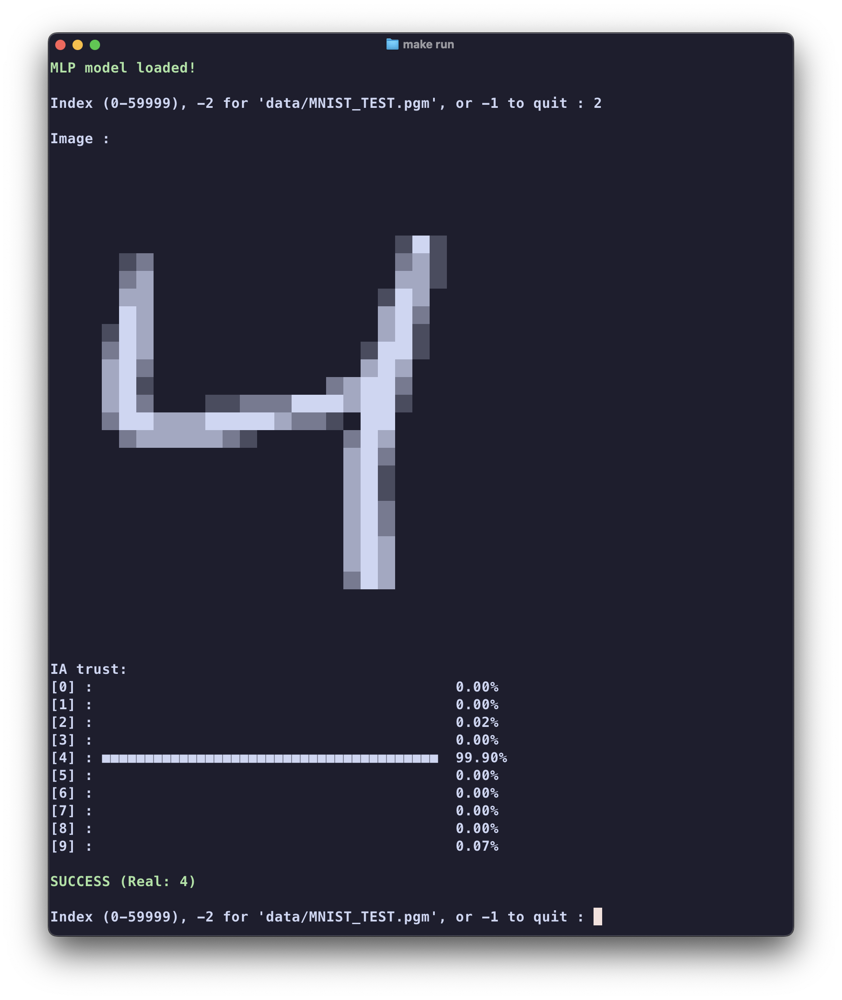
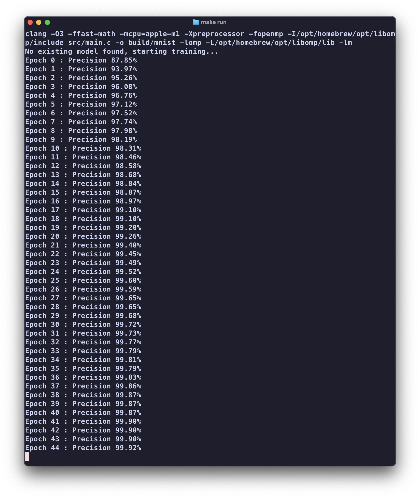

# MNIST MLP C-Inference

A lightweight and high-performance Multilayer Perceptron (MLP) implementation written in pure C.

This project allows you to train a neural network on the MNIST dataset and perform real-time inference on your own handwritten images via the command line.

## Features

- [x] Multi-threading - Accelerated training using OpenMP (batch-level parallelization)

- [x] Hidden Layer - Architecture with one hidden layer (ReLU activation)

- [x] External Image Support - Predict your own .pgm files (28x28)

- [x] Persistence - Automatic saving and loading of the model (.bin)

- [x] ASCII Visualization - View digits and AI confidence levels directly in the terminal

## Images





## Requirements

### Dependencies

- [GCC Compiler](https://gcc.gnu.org/) with OpenMP support

- [MNIST Dataset](https://www.kaggle.com/datasets/hojjatk/mnist-dataset) files (extracted in a `data/` folder):
    - `train-images-idx3-ubyte`
    - `train-labels-idx1-ubyte`

### Installation

#### Debian/Ubuntu:

```bash
sudo apt-get install build-essential libomp-dev
```

#### MacOS:

```bash
brew install libomp
```

### Build

The project uses [OpenMP](https://www.openmp.org/) and aggressive compiler optimizations to maximize CPU performance.

```bash
git clone https://github.com/wirenux/MNIST-MLP-C
cd MNIST-MLP-C
make run
```

### Usage

#### Training Mode

If no `data/mnist_mlp_best.bin` file is found, the program automatically starts training for 100 epochs.

To train with your own PC you just need to : 

```bash
rm data/*.bin
```

#### Inference & Testing

Once the model is loaded, an interactive menu appears:

- `0-59999` - Test a specific image from the MNIST dataset.

- `-2` - Test your custom image located at `data/MNIST_TEST.pgm`.

- `-1` - Quit the program.

#### Confidence Graph Example

```text
IA trust:
[0] :                                          0.00%
[1] :                                          0.00%
[2] :                                          0.00%
[3] : ■■■■■■■■■■■■■■■■■■■■■■■■■■■■■■■■■■■■■■■  98.45%
[4] :                                          0.12%
...
FINAL RESULT: 3
```

### Network Architecture & Theory

The model is a simple feed-forward neural network:

Layer  | Neurons     | Activation | Purpose |
|:------:|:-----------:|:----------:| :--- |
| **Input** | 784 (28x28) | -          | Receives normalized pixel data (0.0 - 1.0) |
| **Hidden** | 128         | [ReLU](https://en.wikipedia.org/wiki/Rectified_linear_unit) | Feature extraction and non-linearity |
| **Output** | 10          | [Softmax](https://en.wikipedia.org/wiki/Softmax_function) | Classifies into digits 0-9 |

### Mathematical Foundation

#### 1. Activation Function (ReLU)

We use the **Rectified Linear Unit** for the hidden layer. It helps the network learn complex patterns by keeping only positive signals.

$${ReLU} (x)=\max(0,x)={\begin{cases}x&{\text{if }}x>0\\0&x\leq 0\end{cases}}$$

#### 2. Optimization (SGD)

The network learns by minimizing the cost function $Q(w)$ using **Stochastic Gradient Descent**. Instead of calculating the error for the entire dataset at once, we use **Mini-batches** of 32 images to update weights efficiently:

$$Q(w) = \frac{1}{n} \sum_{i=1}^{n} Q_{i}(w)$$

#### 3. Output Probability (Softmax)

To get a clear "confidence" percentage for each digit, the final output is processed through the Softmax function:

$$\sigma(\mathbf{z})_i = \frac{e^{z_i}}{\sum_{j=1}^K e^{z_j}}$$

  **Initialization**: He Initialization (optimized for ReLU).

  **Optimizer**: [Stochastic Gradient Descent](https://en.wikipedia.org/wiki/Stochastic_gradient_descent) (SGD) with [Mini-batches](https://www.geeksforgeeks.org/deep-learning/mini-batch-gradient-descent-in-deep-learning/).

  **Learning Rate Decay**: 20% reduction every 20 epochs.

### Custom Images

To test your own digit:

1. Create a **28x28 pixel** image.
2. Draw in **white on a black background** (matching MNSIT format).
3. Export as **PGM** ([https://convertio.co/fr/png-pgm/](https://convertio.co/fr/png-pgm/))
4. Save it as `data/MNIST_TEST.pgm`

### Performance Tuning

- **Preprocessing**: Pixels (0-255) are normalized to floats (0-1) once before training starts.

- **OpenMP Parallelism**: Batch processing is distributed across CPU cores using `#pragma omp parallel for`.

- **Memory Efficiency**: The model structure is serialized directly to a binary file for instant loading.

# 👀 🫵 ⏭️ ⏰ ヾ(＾ ∇ ＾).

#### License

This project is released under the [UNLICENSE](./UNLICENSE) License.

#### Developed with ❤️ & 🧠 by [@wirenux](https://github.com/wirenux)
